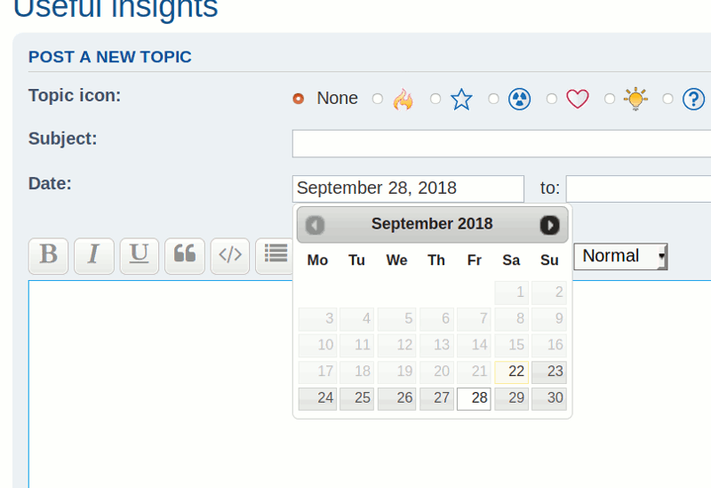
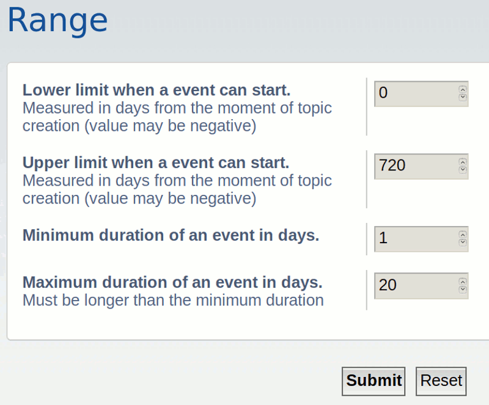
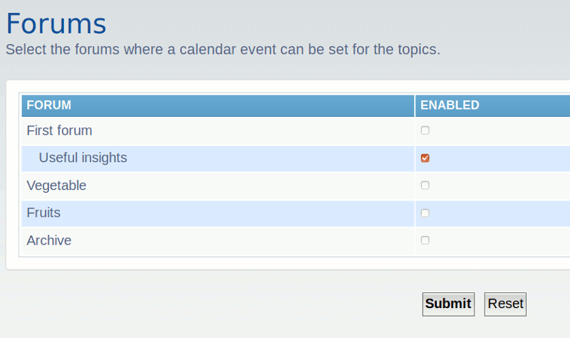
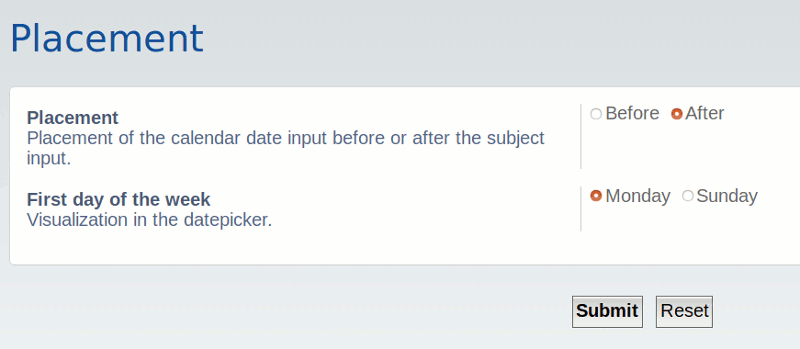
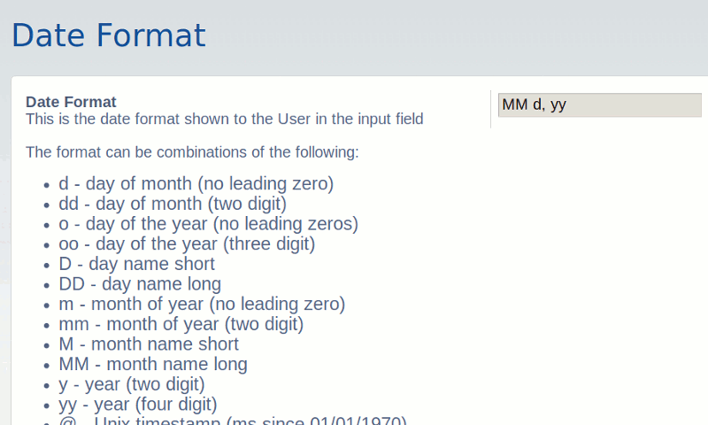
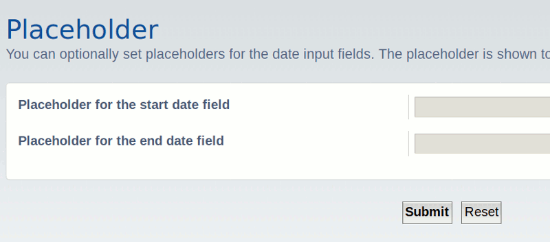

# phpBB Extension - marttiphpbb calendar Mono Input

## Description

This phpBB extension provides single calendar event per topic input for the [Calendar Extension Set](https://github.com/marttiphpbb/phpbb-ext-calendarmono)

## Requirements

* phpBB 3.2.1+
* PHP 7.1+
* PHP calendar extension (PHP compiled with --enable-calendar)
* The phpBB extension [JQuery UI Datepicker (helper ext)](https://github.com/marttiphpbb/phpbb-ext-jqueryuidatepicker)
* phpBB extension [Calendar Mono](https://github.com/marttiphpbb/phpbb-ext-calendarmono) for storing the Calendar Events.

## Screenshots

### Posting

### ACP: Range

### ACP: Forums

### ACP: Placement

### ACP: Date Format

### ACP: Placeholder

## Quick Install

You can install this on the latest release of phpBB 3.2 by following the steps below:

* Create `marttiphpbb/calendarmonoinput` in the `ext` directory.
* Download and unpack the repository into `ext/marttiphpbb/calendarmonoinput`
* Enable `Calendar Mono Input` in the ACP at `Customise -> Manage extensions`.

## Uninstall

* Disable `Calendar Mono Input` in the ACP at `Customise -> Extension Management -> Extensions`.
* To permanently uninstall, click `Delete Data`. Optionally delete the `/ext/marttiphpbb/calendarmonoinput` directory.

## Support

* Report bugs and other issues to the [Issue Tracker](https://github.com/marttiphpbb/phpbb-ext-calendarmonoinput/issues).

## License

[GPL-2.0](license.txt)
